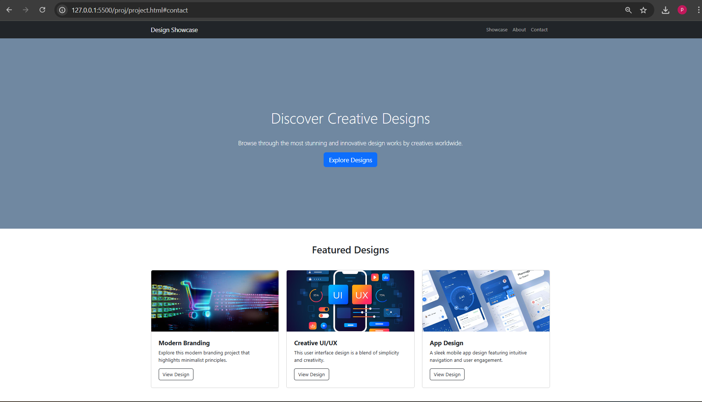
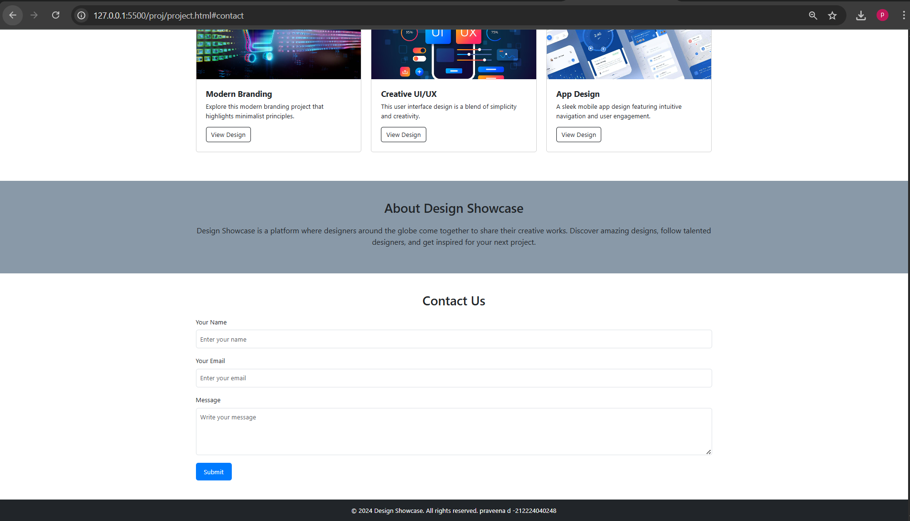

# Project Responsive Web Design using Bootstrap
# Date:23/12/2025
# AIM:
To create a simplified clone of Dribbble (https://dribbble.com/) landing page.

# DESIGN STEPS:
## Step 1:
Clone the repository from GitHub.

## Step 2:
Create Django Admin project.

## Step 3:
Create a New App under the Django Admin project.

## Step 4:
Insert the necessary CSS and JavaScript files as external in order to use Bootstrap.

## Step 5:
Create a HTML file and include the needed Bootstrap components.

## Step 6:
Publish the website in the LocalHost.

# PROGRAM :
~~~
<!DOCTYPE html>
<html lang="en">
<head>
    <meta charset="UTF-8">
    <meta name="viewport" content="width=device-width, initial-scale=1.0">
    <title>Design Showcase</title>
    <link href="https://cdn.jsdelivr.net/npm/bootstrap@5.3.0/dist/css/bootstrap.min.css" rel="stylesheet">
    
</head>
<body>

    <nav class="navbar navbar-expand-lg navbar-dark bg-dark">
        

            <a class="navbar-brand" href="#">Design Showcase</a>
            <button class="navbar-toggler" type="button" data-bs-toggle="collapse" data-bs-target="#navbarNav" aria-controls="navbarNav" aria-expanded="false" aria-label="Toggle navigation">
                
            </button>
            

                <ul class="navbar-nav ms-auto">
                    <li class="nav-item">
                        <a class="nav-link" href="#showcase">Showcase</a>
                    </li>
                    <li class="nav-item">
                        <a class="nav-link" href="#about">About</a>
                    </li>
                    <li class="nav-item">
                        <a class="nav-link" href="#contact">Contact</a>
                    </li>
                </ul>
            

        

    </nav>
    <header class="hero">
        

            <h1 class="display-4">Discover Creative Designs</h1>
            
Browse through the most stunning and innovative design works by creatives worldwide.

            <a href="#showcase" class="btn btn-primary btn-lg">Explore Designs</a>
        

    </header>
    <section id="showcase" class="py-5">
        

            <h2 class="text-center mb-5">Featured Designs</h2>
            

                

                    

                        
                        

                            <h5 class="card-title">Modern Branding</h5>
                            
Explore this modern branding project that highlights minimalist principles.

                            <a href="#" class="btn btn-outline-dark">View Design</a>
                        

                    

                

                

                    

                        
                        

                            <h5 class="card-title">Creative UI/UX</h5>
                            
This user interface design is a blend of simplicity and creativity.

                            <a href="#" class="btn btn-outline-dark">View Design</a>
                        

                    

                

                

                    

                        
                        

                            <h5 class="card-title">App Design</h5>
                            
A sleek mobile app design featuring intuitive navigation and user engagement.

                            <a href="#" class="btn btn-outline-dark">View Design</a>
                        

                    

                

            

        

    </section>
    <section id="about" class="py-5">
        

            <h2 class="text-center mb-4">About Design Showcase</h2>
            
Design Showcase is a platform where designers around the globe come together to share their creative works. Discover amazing designs, follow talented designers, and get inspired for your next project.

        

    </section>

    <section id="contact" class="py-5">
        

            <h2 class="text-center mb-4">Contact Us</h2>
            <form>
                

                    <label for="name" class="form-label">Your Name</label>
                    <input type="text" class="form-control" id="name" placeholder="Enter your name">
                

                

                    <label for="email" class="form-label">Your Email</label>
                    <input type="email" class="form-control" id="email" placeholder="Enter your email">
                

                

                    <label for="message" class="form-label">Message</label>
                    <textarea class="form-control" id="message" rows="4" placeholder="Write your message"></textarea>
                

                <button type="submit" class="btn btn-primary">Submit</button>
            </form>
        

    </section>

    <footer class="bg-dark text-white text-center py-3">
        

            
&copy; 2024 Design Showcase. All rights reserved. praveena d -212224040248

        

    </footer>

    
</body>
</html>
~~~
# OUTPUT:

# RESULT:
The Project for responsive web design using Bootstrap is completed successfully.
